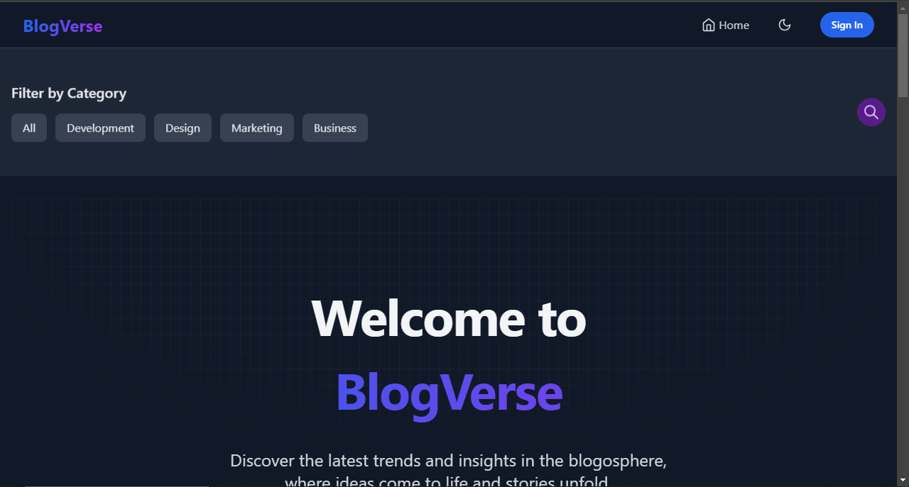
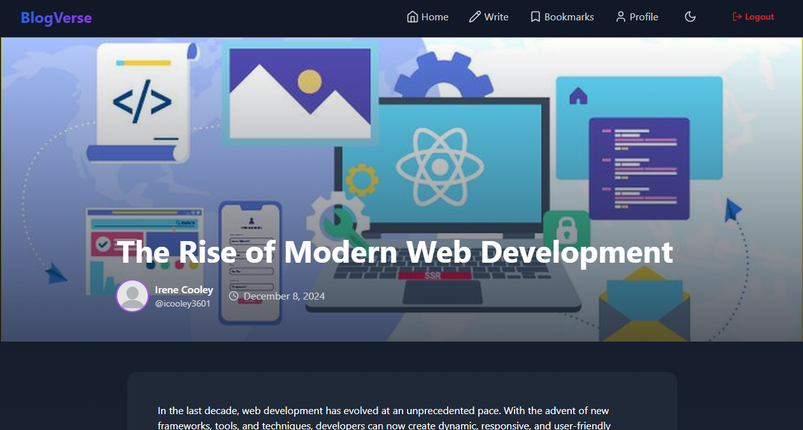
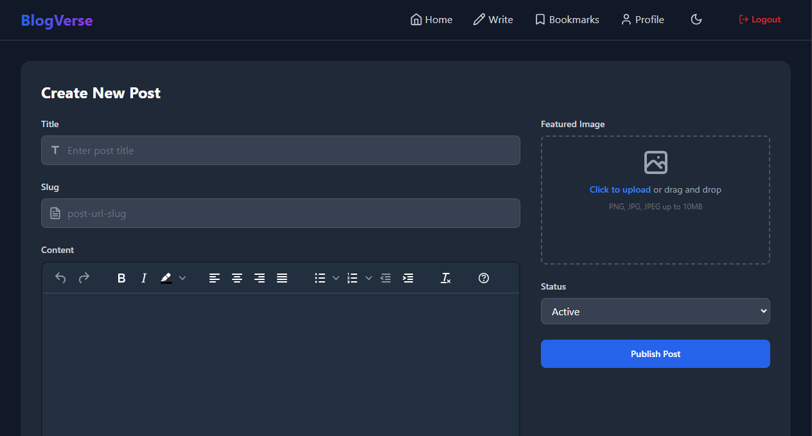
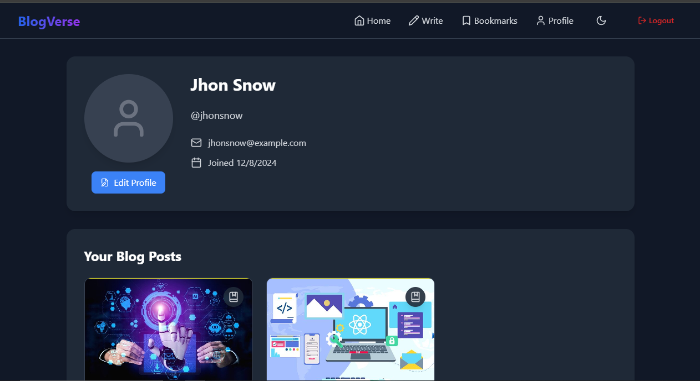

# BlogVerse 📝🌐

A modern and feature-rich blog application built using **React**, **Redux Toolkit**, **Tailwind CSS**, and **React Router**. This app leverages **Appwrite** as a Backend-as-a-Service (BaaS) to provide robust authentication, database, and storage solutions. 🚀

## Features ✨

- Responsive UI with **Tailwind CSS** 🎨
- Appwrite-powered authentication system 🔐
- Dynamic theming with dark mode support 🌓
- Create, edit, and manage posts ✍️
- Bookmark posts for later reading 🔖
- View and manage user profiles 👤
- Rich text editing with **TinyMCE** 📝
- Real-time search functionality 🔍

## Tech Stack 🛠️

- **Frontend**: React, Tailwind CSS, Redux Toolkit, React Router
- **Backend**: Appwrite (Authentication, Database, Storage) 🌐
- **State Management**: Redux Toolkit with `redux-persist`
- **Form Management**: React Hook Form
- **Animations**: Framer Motion

## Appwrite Configuration 🔧

### What is Appwrite? 💡

[Appwrite](https://appwrite.io/) is an open-source Backend-as-a-Service (BaaS) that simplifies backend development by providing:
- User Authentication
- Database Management
- File Storage
- Real-time Functionality

### Environment Configuration 🌍

Create a `.env` file in the root directory with the following configuration:

```env
# Appwrite Configuration
VITE_APPWRITE_URL=https://cloud.appwrite.io/v1
VITE_APPWRITE_PROJECT_ID=your_project_id
VITE_APPWRITE_DATABASE_ID=your_database_id
VITE_APPWRITE_COLLECTION_ID=your_main_collection_id
VITE_APPWRITE_BUCKET_ID=your_storage_bucket_id
VITE_APPWRITE_USER_PROFILE_COLLECTION_ID=your_user_profile_collection_id

# TinyMCE Configuration
VITE_TINYMCE_API_KEY=your_tinymce_api_key
```

### Appwrite Setup Steps 📋

1. Create an account on [Appwrite Cloud](https://cloud.appwrite.io/)
2. Create a new project
3. Set up the following services:
   - Authentication (Email/Password)
   - Database (Create necessary collections)
   - Storage Bucket
4. Replace the placeholder IDs in the `.env` file with your actual Appwrite project details

## Getting Started 🏁

### Prerequisites 📋

Ensure you have the following installed:
- Node.js (v16 or higher) 🟢
- npm or yarn 📦
- Appwrite account and project 🔗

### Installation 🔧

1. Clone the repository:
   ```bash
   git clone https://github.com/lahiruanushka/react-appwrite-blog-app.git
   cd react-appwrite-blog-app
   ```

2. Install dependencies:
   ```bash
   npm install
   ```

3. Configure your `.env` file with Appwrite credentials

4. Start the development server:
   ```bash
   npm run dev
   ```

5. Open the app in your browser:
   ```
   http://localhost:5173
   ```

## Important Notes about Environment Variables 🚨

- Never commit your `.env` file to version control
- Add `.env` to your `.gitignore`
- Use `.env.example` to provide a template for other developers
- Keep your API keys and project IDs confidential

## Folder Structure 📂

```
src
├── components        # Shared components like Header, Footer, etc.
├── context           # Context providers like ToastContext
├── pages             # Page components for routes
├── redux             # Redux slices and store configuration
├── index.css         # Tailwind and global styles
├── utils             # Helper functions
└── App.js            # Main application component
```
## Screenshots 📸

### 🏠 Homepage

*Explore the latest blog posts and navigate through the application's main landing page.*

### 📄 Post Page

*Dive into detailed blog post content with rich text rendering and interactive features.*

### ✍️ Create Post Page

*Easily create and publish new blog posts using the intuitive post creation interface.*

### 👤 User Profile Page

*Manage your profile, view your published posts, and customize your personal information.*

## Available Scripts 🖥️

- `npm run dev`: Start the development server
- `npm run build`: Build the app for production
- `npm run preview`: Preview the production build
- `npm run lint`: Run the linter

## Contributing 🤝

Contributions are welcome! Please follow these steps:
1. Fork the repository
2. Create your feature branch (`git checkout -b feature/AmazingFeature`)
3. Commit your changes (`git commit -m 'Add some AmazingFeature'`)
4. Push to the branch (`git push origin feature/AmazingFeature`)
5. Open a Pull Request

## License 📄

This project is licensed under the MIT License. See `LICENSE` for more information.

## Acknowledgments 🙏

- Inspired by modern blogging platforms
- Thanks to the creators of the tools and libraries used in this project

## Contact 📬

Got questions? Reach out to:
- Email: [lahiruanushkaofficial@gmail.com] 📧
- GitHub: [https://github.com/lahiruanushka] 🐱

Happy Blogging! 🎉✍️